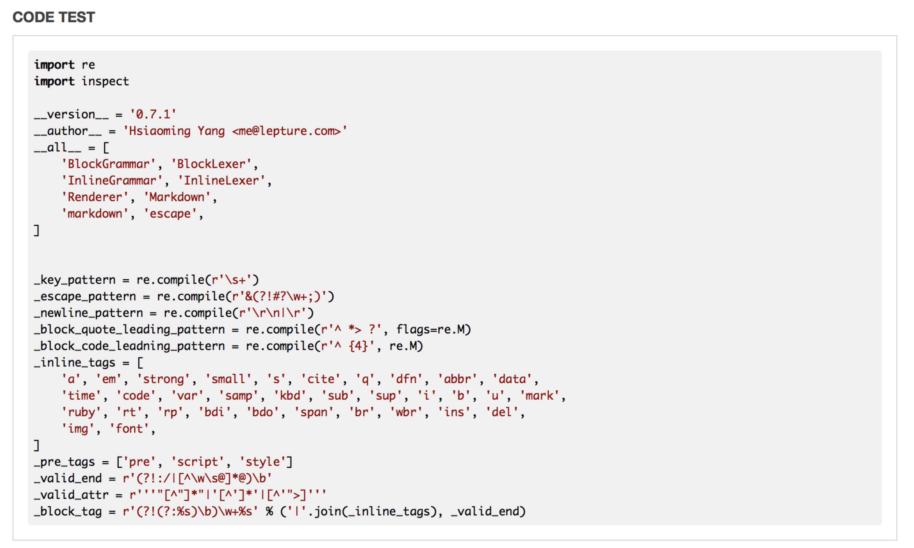

VIM Markdown Preview
---

**PS: [*中文文档版本*](http://mikecoder.cn/?post=131)**

Yet another vim markdown preview plugin.

####Installing

**Recommand Bundle or Vundle**

##### Vundle
1. you can see how to install vundle [here](https://github.com/VundleVim/Vundle.vim)
2. after you install your vundle, make sure your plugins folder is **~/.vim/bundle**
3. then you can write this plugin url into your **.vimrc** file, like **Plugin 'MikeCoder/markdown-preview.vim'**
4. then use **PluginInstall** to install the plugin

##### Recommand:k-vim
1. add **Bundle 'MikeCoder/markdown-preview.vim'** to your **vimrc.bundle** file
2. and exec **BundleInstall** to install the plugin

##### Usual Install
1. this is not a good choice, make sure every step is right
2. use **cd ~/.vim** into your vim folder
3. use **git clone https://github.com/MikeCoder/markdown-preview.vim.git .**
4. use **mv markdown-preview.vim/* . && rm -rf markdown-preview.vim**
5. use **cp resources MarkDownRes** to copy the resources
6. then you can open your vim and type **MarkdownPreview Github** to check whether it is ok

####Usage

1. edit your markdown doc normally
2. when you want to preview it in html you just use **:MarkdownPreview defult** to show your doc in your browser
3. if you want to change your style. you just use **:MarkdownPreview GitHub** in github style markdown view
4. you can also use **map <leader>m :MarkdownPreview GitHub<CR>** to have more fun

####Custom
this theme is in the css folder, if you want to change it to your favorite theme. follow the steps:

- go into your .vim folder
- find **MarkDownRes** folder and you will find default.css and GitHub.css here
- add your custom css file here, such as **exmaple.css**
- use vim open your markdown doc and **:MarkdownPreview example**
- and you will see your doc preview in your browser with example.css

####Thanks
1. mistune
2. vim

####TODO
see [@TODO.md](https://github.com/MikeCoder/markdown-preview.vim/blob/master/TODO.md)

####EXAMPLE

####LAST
wish you have a nice day

####LECENSE
Copyright since 2015, Mike Tang.

Redistribution and use in source and binary forms, with or without
modification, are permitted provided that the following conditions are
met:

 1. Redistributions of source code must retain the above copyright
    notice, this list of conditions and the following disclaimer.

 2. Redistributions in binary form must reproduce the above copyright
    notice, this list of conditions and the following disclaimer in
    the documentation and/or other materials provided with the
    distribution.

 3. Neither the name of Mike Tang nor the names of its
    contributors may be used to endorse or promote products derived
    from this software without specific prior written permission.

THIS SOFTWARE IS PROVIDED BY THE AUTHOR AS IS AND ANY EXPRESS OR
IMPLIED WARRANTIES, INCLUDING, BUT NOT LIMITED TO, THE IMPLIED
WARRANTIES OF MERCHANTABILITY AND FITNESS FOR A PARTICULAR PURPOSE ARE
DISCLAIMED. IN NO EVENT SHALL THE AUTHOR BE LIABLE FOR ANY DIRECT,
INDIRECT, INCIDENTAL, SPECIAL, EXEMPLARY, OR CONSEQUENTIAL DAMAGES
(INCLUDING, BUT NOT LIMITED TO, PROCUREMENT OF SUBSTITUTE GOODS OR
SERVICES; LOSS OF USE, DATA, OR PROFITS; OR BUSINESS INTERRUPTION)
HOWEVER CAUSED AND ON ANY THEORY OF LIABILITY, WHETHER IN CONTRACT,
STRICT LIABILITY, OR TORT (INCLUDING NEGLIGENCE OR OTHERWISE) ARISING
IN ANY WAY OUT OF THE USE OF THIS SOFTWARE, EVEN IF ADVISED OF THE
POSSIBILITY OF SUCH DAMAGE.

