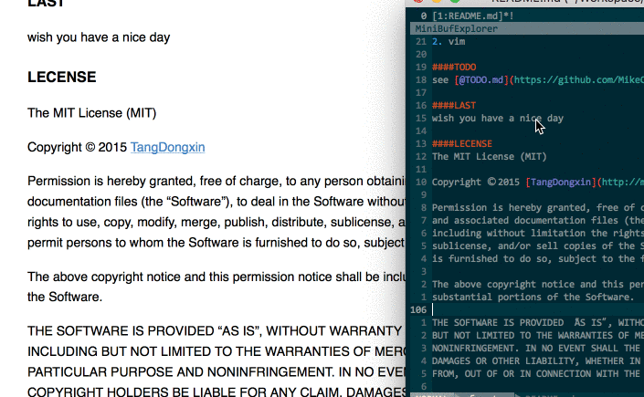

VIM Markdown Preview
---
Yet another vim markdown preview plugin.

####Why you need this
1. It's easy to install with vundle or bundle
2. No complex config steps
3. **Code Hightlight**
4. Easy to custom your own css style
5. Code custom style hightlight(using [hightlight.js](https://highlightjs.org/))
6. Sync Scroll

####Installing

**Recommand Bundle or Vundle**

##### Vundle
1. you can see how to install vundle [here](https://github.com/VundleVim/Vundle.vim)
2. after you install your vundle, make sure your plugins folder is **~/.vim/bundle**
3. then you can write this plugin url into your **.vimrc** file, like **Plugin 'MikeCoder/markdown-preview.vim'**
4. then use **PluginInstall** to install the plugin

##### Recommand:[k-vim](https://github.com/wklken/k-vim)
1. add **Bundle 'MikeCoder/markdown-preview.vim'** to your **vimrc.bundle** file
2. and exec **BundleInstall** to install the plugin

##### Usual Install
1. this is not a good choice, make sure every step is right
2. use **cd ~/.vim** into your vim folder
3. use **git clone https://github.com/MikeCoder/markdown-preview.vim.git .**
4. use **mv markdown-preview.vim/* . && rm -rf markdown-preview.vim**
5. use **cp resources MarkDownRes** to copy the resources
6. then you can open your vim and type **:MarkdownPreview Github** to check whether it is ok

####Usage

#####Commen Usage
1. edit your markdown doc normally
2. when you want to preview it in html you just use **:MarkdownPreview defult** to show your doc in your browser
3. if you want to change your style. you just use **:MarkdownPreview GitHub** in github style markdown view
4. you can also use the following code to have more fun
```
map <leader>m :MarkdownPreview GitHub<CR>
```

#####Advanced Usage
######Preview with custom code sytle and body style
1. use **:MarkdownPreviewWithCustomCodeStyle css-style code-style** instead
2. you can use custom css style and code hightlight style
3. the following code styles are you can use:
    + github
    + solarized_dark
    + solarized_light
    + default
    + color-brewer
    + railscasts
    + tomorrow
    + zenburn
    + mono
    + monokai_sublime
4. these code css files are in your **~/.vim/MarkDownRes/code-styles** folder
5. for example, when you use **:MarkdownPreviewWithCustomCodeStyle Github zenburn**, when edit the [TEST.md](./TEST.md)
    

######Preview with live (*experiment*)



1. use **:LiveMarkdownPreviewStart** to start the brower and the markdown server
2. you can see your default browser open your markdown page
3. and you can see what you type in the brower and move to your current position
4. **IMPORTANT** please remember to use **:LiveMarkdownPreviewEnd** to end the server
5. if you forget to end the server and you may fail to preview again
6. when you see the **Address already in use**, you can use the shell to kill the previous vim process **killall -9 vim or find your vim process maybe it call Vim** to reset the server

####Custom
this theme is in the css folder, if you want to change it to your favorite theme. follow the steps:

- go into your .vim folder
- find **MarkDownRes** folder and you will find default.css and GitHub.css here
- add your custom css file here, such as **example.css**
- use vim open your markdown doc and **:MarkdownPreview example**
- and you will see your doc preview in your browser with example.css

####Thanks
1. mistune
2. vim

####TODO
see [@TODO.md](https://github.com/MikeCoder/markdown-preview.vim/blob/master/TODO.md)

####LAST
wish you have a nice day

####LECENSE
The MIT License (MIT)

Copyright © 2015 [TangDongxin](http://mikecoder.cn)

Permission is hereby granted, free of charge, to any person obtaining a copy of this software
and associated documentation files (the “Software”), to deal in the Software without restriction,
including without limitation the rights to use, copy, modify, merge, publish, distribute,
sublicense, and/or sell copies of the Software, and to permit persons to whom the Software
is furnished to do so, subject to the following conditions:

The above copyright notice and this permission notice shall be included in all copies or
substantial portions of the Software.

THE SOFTWARE IS PROVIDED “AS IS”, WITHOUT WARRANTY OF ANY KIND, EXPRESS OR IMPLIED, INCLUDING
BUT NOT LIMITED TO THE WARRANTIES OF MERCHANTABILITY, FITNESS FOR A PARTICULAR PURPOSE AND
NONINFRINGEMENT. IN NO EVENT SHALL THE AUTHORS OR COPYRIGHT HOLDERS BE LIABLE FOR ANY CLAIM,
DAMAGES OR OTHER LIABILITY, WHETHER IN AN ACTION OF CONTRACT, TORT OR OTHERWISE, ARISING
FROM, OUT OF OR IN CONNECTION WITH THE SOFTWARE OR THE USE OR OTHER DEALINGS IN THE SOFTWARE.

