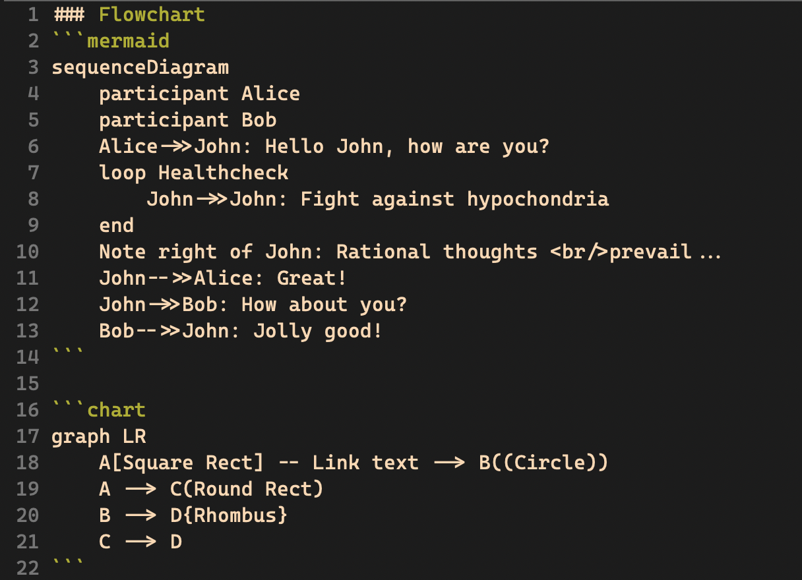
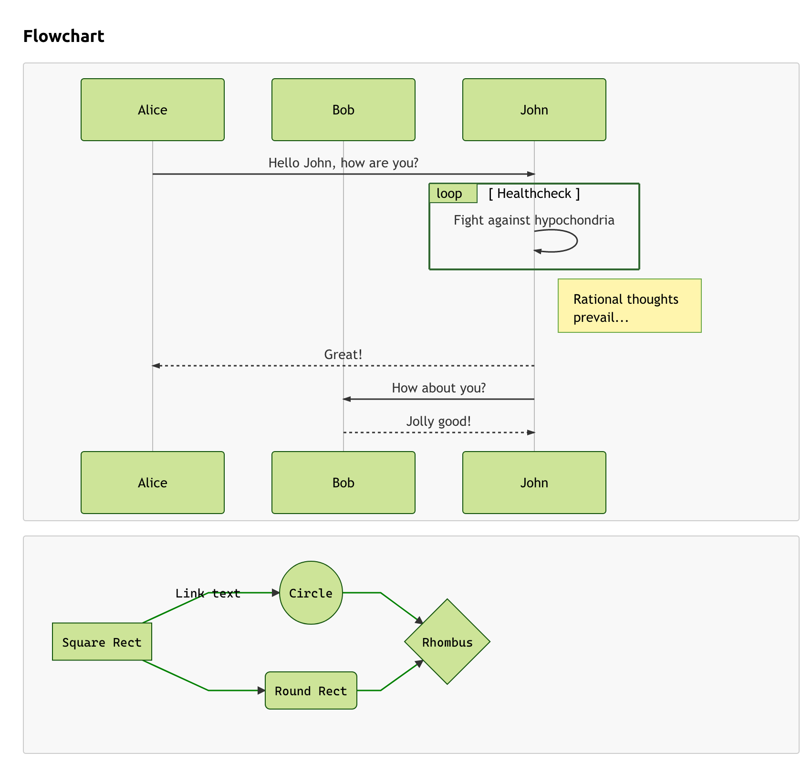

markdown-preview.vim
---


Yet another vim markdown preview plugin. Not suitable for Windows.

### Why you need this
0. **[CommonMark](http://commonmark.org/) Syntax Support**
1. It's easy to install with vundle or bundle
2. No complex config steps
3. **Code Hightlight**
4. Easy to custom your own css style
5. Code custom style hightlight(using [hightlight.js](https://highlightjs.org/))
6. **Now support flowcharts feature!** (based on [mermaid](https://github.com/knsv/mermaid), should read the doc first)

### Dependency
You may install some libraries first:

```
(sudo) pip install future
(sudo) pip install mistune
```

### Installing
**Recommend Bundle or Vundle**

#### Vundle
1. you can see how to install vundle [here](https://github.com/VundleVim/Vundle.vim)
2. after you install your vundle, make sure your plugins folder is **~/.vim/bundle**
3. then you can write this plugin url into your **.vimrc** file, like **Plugin 'D0n9X1n/markdown-preview.vim'**
4. then use **PluginInstall** to install the plugin

#### Install without Vundle or other pacakage management plugins
1. this is not a good choice, make sure every step is right
2. use **cd ~/.vim** into your vim folder
3. use **git clone https://github.com/D0n9X1n/markdown-preview.vim.git .**
4. use **mv markdown-preview.vim/* . && rm -rf markdown-preview.vim**
5. use **cp -r resources MarkDownRes ** to copy the resources
6. then you can open your vim and type **:MarkdownPreview Github** to check whether it is ok

### Usage
You can see example document here [TEST.md](./TEST.md)

### Config
If your plugin folder is not `.vim/bundle`, you should config it first, by adding these into your .vimrc file:

Like:
```
" markdown-preview.vim {{{
    let g:PluginDir = '/Users/Mike/.vim/bundle/markdown-preview.vim'
" }}}
```
+ g:PluginDir is where your markdown-preview.vim plugin is.

#### Common Usage
1. edit your markdown doc normally
2. when you want to preview it in html you just use **:MarkdownPreview default** to show your doc in your browser
3. if you want to change your style. you just use **:MarkdownPreview GitHub** in github style markdown view
4. you can also use the following code to your vimrc file to bind key maps.
```
map <leader>m :MarkdownPreview GitHub<CR>
```

### Advanced Usage
#### Preview with custom code sytle and body style
1. use **:MarkdownPreviewWithCustomCodeStyle css-style code-style** instead
2. you can use custom css style and code hightlight style
3. the following are code styles you can use:
    + github
    + solarized_dark
    + solarized_light
    + default
    + color-brewer
    + railscasts
    + tomorrow
    + zenburn
    + mono
    + monokai_sublime
4. these code css files are in your **~/.vim/MarkDownRes/code-styles** folder
5. for example, when you use **:MarkdownPreviewWithCustomCodeStyle GitHub zenburn**, when edit the [TEST.md](./TEST.md)
> 

#### For flowcharts
I don't recommand you to use this feature due to many websites or editors not supporting this feature which may confuse you.
However, if you want to use the flowcharts feature, you must add the type when you writing flowcharts, for example, when you write,
you should add keyword **chart** or **mermaid** to the code block as below:
> 

Then when you use `MarkdownPreview github`, you can see the result as below:
> 

#### Customize
This theme is in the css folder, if you want to change it to your favorite theme. follow the steps:
- go into your *markdown-preview.vim* folder
- find **resources** folder and you will find default.css and github.css here
- add your custom css file here, such as **example.css**
- use vim open your markdown doc and **:MarkdownPreview example**
- and you will see your doc preview in your browser with example.css

#### Thanks
0. [rtfd/CommonMark-py](https://github.com/rtfd/CommonMark-py)
1. [vim](https://github.com/vim/vim)
2. [mermaid](https://github.com/knsv/mermaid)

#### TODO
See [@TODO.md](https://github.com/D0n9X1n/markdown-preview.vim/blob/master/TODO.md)

#### LAST
Wish you have a nice day

#### LICENSE
See [@LICENSE](./LICENSE)
