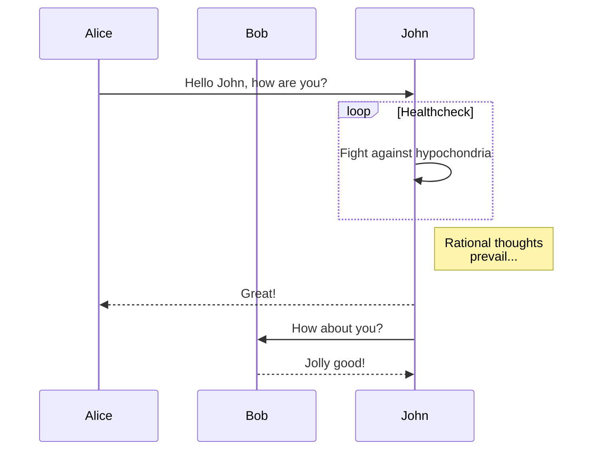
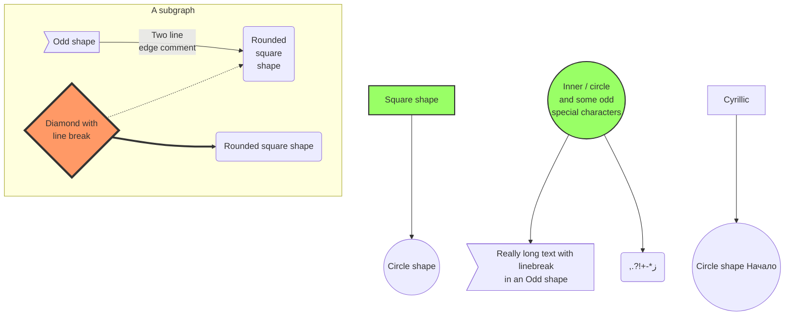

### Flowchart


```chart
graph LR
    A[Square Rect] -- Link text --> B((Circle))
    A --> C(Round Rect)
    B --> D{Rhombus}
    C --> D
```



```chart
sequenceDiagram
    loop Daily query
        Alice->>Bob: Hello Bob, how are you?
        alt is sick
            Bob->>Alice: Not so good :(
        else is well
            Bob->>Alice: Feeling fresh like a daisy
        end

        opt Extra response
            Bob->>Alice: Thanks for asking
        end
    end
```

### HTML BLOCK

<center> In god we trust. </center>

### Table
| Tables        | Are           | Cool  |
| ------------- |:-------------:| -----:|
| col 3 is      | right-aligned | $1600 |
| col 2 is      | centered      |   $12 |
| zebra stripes | are neat      |    $1 |

### PYTHON
```
#!/usr/bin/env python
# encoding: utf-8

class Solution(object):

    def wordPattern(self, pattern = "", target = ""):
        pmap, qmap = {}, {}
        for idx in range(len(pattern)):
            ch = pattern[idx]
            if pmap.has_key(ch):
                pmap[ch] += str(idx)
            else: pmap[ch] = str(idx)

        strs = target.split(' ')
        for idx in range(len(strs)):
            ch = strs[idx]
            if qmap.has_key(ch):
                qmap[ch] += str(idx)
            else: qmap[ch] = str(idx)

        if len(pattern) != len(strs) or len(qmap) != len(pmap):
            return False
        return set(qmap.values()) == set(pmap.values())

if __name__ == '__main__':
    print Solution().wordPattern("aba", "a b a")
    print Solution().wordPattern("ab", "happy hacking")

```

### C/C++
```
class Solution {
    public:
        int hIndex(vector<int>& scores) {
            int len = scores.size(), i;
            vector<int> count(len+1, 0);
            for(i=0; i<len; ++i) scores[i] >=len?++count[len]:++count[scores[i]];
            for(i=len; i>0 && count[i]<i; --i, count[i]+=count[i+1]);
            return i;
        }
};

int main() {
    vector<int> scores;
    scores.push_back(100);
    Solution s;
    cout << s.hIndex(scores) << endl;
    return 0;
}
```

### Java
```
public class FourSum {
    public static void main(String[] args) {
        int nums[] = { 0, 0, 0, 0 };
        System.out.println(fourSum(nums, 0));
    }

    public static List<List<Integer>> fourSum(int[] nums, int target) {
        Arrays.sort(nums);
        List<List<Integer>> res = new LinkedList<List<Integer>>();
        if (nums.length < 4) return res;

        for (int i = 0; i <= nums.length - 4; i++) {
            if (i > 0 && nums[i] == nums[i - 1]) continue;
            List<List<Integer>> tmp = threeSum(nums, target - nums[i], i);
            res.addAll(tmp);
        }
        return res;
    }

    public static List<List<Integer>> threeSum(int[] nums, int TARGET, int begin) {
        List<List<Integer>> result = new java.util.LinkedList<java.util.List<Integer>>();

        if (nums.length - begin < 3) return result;

        for (int i = begin + 1; i < nums.length; i++) {
            if (i > begin + 1 && nums[i] == nums[i - 1]) {
                continue;
            }
            int start = i + 1;
            int end = nums.length - 1;
            while (start < end) {
                int res = nums[i] + nums[start] + nums[end];
                if (res == TARGET) {
                    java.util.LinkedList<Integer> pair = new java.util.LinkedList<Integer>();
                    pair.add(nums[begin]);
                    pair.add(nums[i]);
                    pair.add(nums[start]);
                    pair.add(nums[end]);
                    if (!result.contains(pair)) {
                        result.add(pair);
                    }
                    start++;
                } else if (res < TARGET) {
                    start++;
                    while (nums[start] == nums[start - 1] && start < end) {
                        start++;
                    }
                } else {
                    end--;
                    while (nums[end] == nums[end + 1] && start < end) {
                        end--;
                    }
                }
            }
        }
        return result;
    }
}
```

### 中文测试
中文测试，希望中国男子足球队勇夺世界杯！
