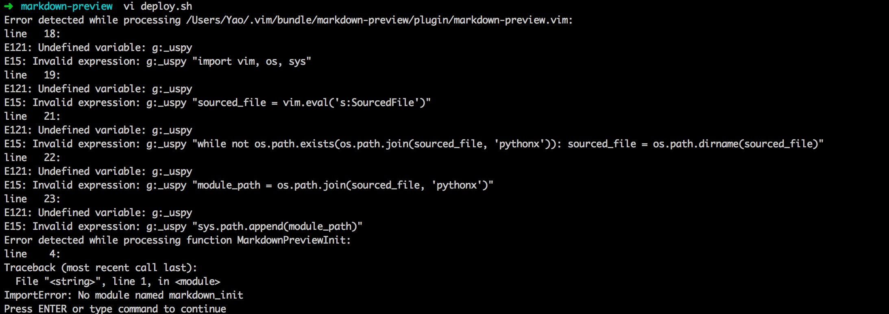

#TODO LIST
---
###FEATURES
1. **√** ~~add css file support and config~~
2. **√** ~~remove pip support~~
3. **√** ~~add code highlight~~
4. **√** ~~add normal install method test~~
5. **√** ~~code sytle custom support~~
6. add code custom document
7. add config introduction

###BUGS
1. **√** ~~fix the image url bug~~
2. **√** ~~if use gvim open a file instead of a folder and preview, the preview is wrong~~
3. **√** ~~if vim version is 7.3 or not enable python, it will cause bugs like:~~
    > 
